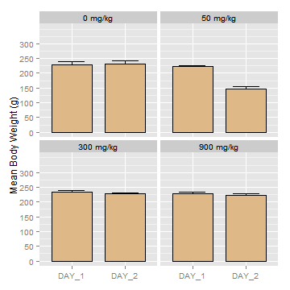
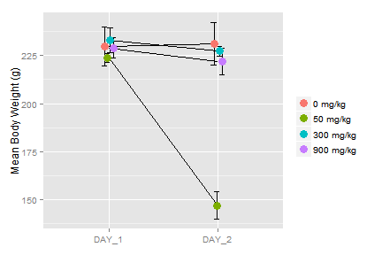
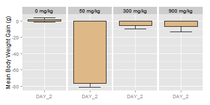
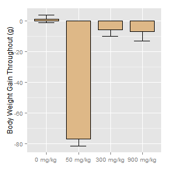
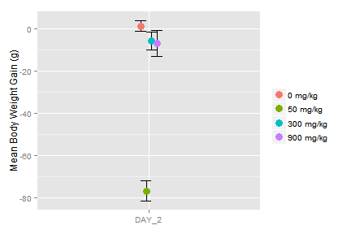
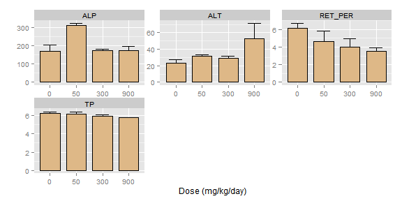

HIGH DOSE TK - QUICK SUMMARY
=======================

STUDY INFORMATION
-----------------

```
Study No.                       | RRDCC-PK-14-068                             
Project                         | HBV Capsid (2)                              
Theme No.                       | 7907                                        
Compound SRN                    | RO7049389-000                               
Compound ERN                    | RO7049389-000-005                           
GLP Status                      | Non-GLP                                     
Safety Plan ID                  | N/A                                         
Groups                          | 5                                           
Doses                           | 0, 100, 300, and 900 mpk                    
Route of Administration         | Oral Gavage                                 
Frequency of administration     | qd                                          
Animal Species and Strain       | Wistar-Han Rat                              
First Dosing Date               | -                                           
Last Dosing Date                | -                                           
Necropsy Date                   | -                                           
Day                             | 2                                           
Study Director                  | Xiaoqin Wu                                  
TPL                             | Spacey Sun                                  
DPL                             | Dr. Frances Wang                            
In-life Procedures              | Xiaoqin Wu, Sunfeng Huang                   
Formulation Analysis            | Sheng Zhong, Jian Xin, Yan Bo, Dr. Wenzhe Lu
Bioanalysis                     | Sheng Zhong, Jian Xin, Yan Bo, Dr. Wenzhe Lu
Clinical Pathology              | Guoji Zhang (Medicilon)                     
Histopathology                  | -                                           
Histopathology Peer Review      | -                                           
 -- Group Information --        |  -- Group Information --                    
Group 1: 101-103                | enter information here                      
Group 2: 201-203                | enter information here                      
Group 3: 301-303                | enter information here                      
```

******
1. BODY WEIGHT
--------------

### 1.1 Body Weight - Summary Table

```
      DOSE    DAY_1    DAY_2
   0 mg/kg 230 ¡À 10 231 ¡À 11
  50 mg/kg  224 ¡À 2  147 ¡À 7
 300 mg/kg  233 ¡À 7  227 ¡À 3
 900 mg/kg  229 ¡À 5  222 ¡À 7
```

### 1.2 Body Weight - Statistical Analysis

```
                DOSE  DAY_1   DAY_2
             0 mg/kg    ---     ---
            50 mg/kg    --- p<0.001
           300 mg/kg    ---     ---
           900 mg/kg    ---     ---
              LEVENE   PASS    PASS
          ANOVA (p=) 0.4445       0
 KRUSKAL-WALLIS (p=)      -       -
         - SUMMARY -    ---     ***
```


### 1.3 Body Weight - Charts
 

 

******
2 BODY WEIGHT GAIN
------------------

### 2.1 Body Weight Gain - Summary Table

```
      DOSE   DAY_2     SUM
   0 mg/kg   1 ¡À 3   1 ¡À 3
  50 mg/kg -77 ¡À 5 -77 ¡À 5
 300 mg/kg  -6 ¡À 4  -6 ¡À 4
 900 mg/kg  -7 ¡À 6  -7 ¡À 6
```

### 2.2 Body Weight Gain - Statistical Aanalysis

```
                DOSE   DAY_2     SUM
             0 mg/kg     ---     ---
            50 mg/kg p<0.001 p<0.001
           300 mg/kg     ---     ---
           900 mg/kg     ---     ---
              LEVENE    PASS    PASS
          ANOVA (p=)       0       0
 KRUSKAL-WALLIS (p=)       -       -
         - SUMMARY -     ***     ***
```

### 2.3 Body Weight Gain - Charts
 

 

 

******
3. CLINICAL PATHOLOGY
---------------------

### 3.1 Clinical Pathology - Summary Table

```
      DOSE           ALP        TBIL        UREA            ASP
   0 mg/kg   171 ¡À 33.29     0.1 ¡À 0 4.76 ¡À 0.55    115 ¡À 12.49
  50 mg/kg   311 ¡À 10.15 0.13 ¡À 0.06 4.64 ¡À 0.36  101.33 ¡À 1.53
 300 mg/kg 172.67 ¡À 9.02     0.1 ¡À 0 4.64 ¡À 0.36         95 ¡À 9
 900 mg/kg   175 ¡À 22.72 0.13 ¡À 0.06 5.12 ¡À 0.55 105.33 ¡À 14.98

---

      DOSE          ALT   GGT           UN        CREA
   0 mg/kg 23.33 ¡À 4.04 0 ¡À 0 13.33 ¡À 1.53 0.17 ¡À 0.06
  50 mg/kg 31.33 ¡À 2.08 0 ¡À 0       13 ¡À 1   0.2 ¡À 0.1
 300 mg/kg    29 ¡À 2.65 0 ¡À 0       13 ¡À 1     0.1 ¡À 0
 900 mg/kg   53 ¡À 18.03 0 ¡À 0 14.33 ¡À 1.53     0.2 ¡À 0

---

      DOSE          TP         ALB         GLO          AG
   0 mg/kg 6.27 ¡À 0.15   4.5 ¡À 0.1 1.77 ¡À 0.12 2.55 ¡À 0.17
  50 mg/kg  6.2 ¡À 0.17   4.4 ¡À 0.1   1.8 ¡À 0.1 2.45 ¡À 0.12
 300 mg/kg 5.93 ¡À 0.15 4.37 ¡À 0.31 1.57 ¡À 0.15 2.82 ¡À 0.49
 900 mg/kg     5.8 ¡À 0  4.3 ¡À 0.17  1.5 ¡À 0.17  2.9 ¡À 0.48

---

      DOSE           GLU          TCHO            TG           NA.
   0 mg/kg  85.67 ¡À 6.11     89 ¡À 5.29    81 ¡À 40.95 142.67 ¡À 0.58
  50 mg/kg  89.67 ¡À 3.21 89.33 ¡À 23.59  56.67 ¡À 12.5       143 ¡À 2
 300 mg/kg 84.33 ¡À 18.23 76.67 ¡À 12.66    55 ¡À 18.36    143 ¡À 2.65
 900 mg/kg    87 ¡À 16.09 62.67 ¡À 14.57 70.67 ¡À 30.66 143.67 ¡À 0.58

---

      DOSE           K            CL           CA           P
   0 mg/kg 5.93 ¡À 0.71        99 ¡À 1 10.73 ¡À 0.06  7.3 ¡À 0.69
  50 mg/kg  6.4 ¡À 0.56    100 ¡À 1.73 11.07 ¡À 0.15 8.57 ¡À 0.55
 300 mg/kg 6.03 ¡À 0.25 100.33 ¡À 1.53 10.57 ¡À 0.15 9.27 ¡À 0.87
 900 mg/kg 6.13 ¡À 0.15 100.33 ¡À 1.15 10.87 ¡À 0.64  9.6 ¡À 1.51

---

      DOSE              CK         WBC         RBC          HGB
   0 mg/kg    854 ¡À 297.61 5.63 ¡À 1.61 6.96 ¡À 0.54  14.3 ¡À 0.14
  50 mg/kg 1090.67 ¡À 273.5 4.33 ¡À 1.94 6.86 ¡À 0.52  8.1 ¡À 10.04
 300 mg/kg 587.33 ¡À 200.28 5.29 ¡À 1.42 6.99 ¡À 0.52 13.83 ¡À 0.65
 900 mg/kg 799.67 ¡À 341.52 6.11 ¡À 0.99 7.68 ¡À 0.07 15.07 ¡À 0.15

---

      DOSE          HCT          MCV           MCH          MCHC
   0 mg/kg 42.65 ¡À 2.62 61.35 ¡À 0.92  20.55 ¡À 1.34    33.5 ¡À 1.7
  50 mg/kg 42.95 ¡À 3.46  62.6 ¡À 0.28 11.35 ¡À 13.79 18.05 ¡À 21.99
 300 mg/kg  41.23 ¡À 2.4 59.07 ¡À 1.75   19.8 ¡À 0.72  33.47 ¡À 0.35
 900 mg/kg    45 ¡À 0.89 58.67 ¡À 1.27  19.63 ¡À 0.38  33.47 ¡À 0.47

---

      DOSE             PLT       RDW.CV        NEUT      NEUT_PER
   0 mg/kg  1051.5 ¡À 64.35  13.4 ¡À 1.41 1.19 ¡À 0.93 19.55 ¡À 10.82
  50 mg/kg    805 ¡À 205.06 12.15 ¡À 0.49 0.48 ¡À 0.32   10.7 ¡À 2.55
 300 mg/kg 1071.33 ¡À 49.22    12 ¡À 0.78 0.66 ¡À 0.24  12.47 ¡À 1.98
 900 mg/kg 1049.33 ¡À 58.79 11.13 ¡À 0.91 0.68 ¡À 0.07  11.37 ¡À 2.66

---

      DOSE       LYMPH    LYMPH_PER        MONO    MONO_PER
   0 mg/kg  4.2 ¡À 0.57  76.2 ¡À 11.6 0.07 ¡À 0.03 1.25 ¡À 0.21
  50 mg/kg  3.7 ¡À 1.59 86.25 ¡À 2.05 0.06 ¡À 0.01 1.45 ¡À 0.49
 300 mg/kg 4.45 ¡À 1.17 84.37 ¡À 1.96 0.06 ¡À 0.02 1.07 ¡À 0.06
 900 mg/kg 5.23 ¡À 1.02 85.33 ¡À 3.15 0.06 ¡À 0.01    1 ¡À 0.26

---

      DOSE          EO      EO_PER        BASO    BASO_PER
   0 mg/kg  0.1 ¡À 0.06 1.75 ¡À 0.49    0.01 ¡À 0 0.23 ¡À 0.12
  50 mg/kg 0.04 ¡À 0.01     0.9 ¡À 0    0.01 ¡À 0     0.1 ¡À 0
 300 mg/kg 0.06 ¡À 0.02 1.23 ¡À 0.38 0.01 ¡À 0.01   0.1 ¡À 0.1
 900 mg/kg 0.07 ¡À 0.01 1.17 ¡À 0.35    0.01 ¡À 0 0.15 ¡À 0.07

---

      DOSE         LUC     LUC_PER            RET     RET_PER
   0 mg/kg 0.05 ¡À 0.04  0.93 ¡À 0.4    416 ¡À 37.25 6.12 ¡À 0.55
  50 mg/kg 0.05 ¡À 0.03 0.85 ¡À 0.35 334.75 ¡À 85.35 4.65 ¡À 1.16
 300 mg/kg 0.04 ¡À 0.02   0.7 ¡À 0.2 283.67 ¡À 39.88  4.02 ¡À 0.9
 900 mg/kg 0.06 ¡À 0.02 0.95 ¡À 0.35  272.7 ¡À 30.55 3.54 ¡À 0.35

---
```


### 3.2 Clinical Pathology - Statistical Analysis

```
                DOSE     ALP    ALT     TP RET_PER
             0 mg/kg     ---    ---    ---     ---
            50 mg/kg p<0.001    ---    ---     ---
           300 mg/kg     ---    ---    ---     ---
           900 mg/kg     --- p<0.01 p<0.05  p<0.05
              LEVENE    PASS      ~   PASS    PASS
          ANOVA (p=)   1e-04 0.0112   0.01  0.0374
 KRUSKAL-WALLIS (p=)       -      -      -       -
         - SUMMARY -     ***      *      *       *
```

#### Full Names of Indices with Statistical Significance

```
ALP  -  Alkaline Phosphatase (U/L)    
ALT  -  Alanine Aminotransferase (U/L)
TP  -  Total Protein (g/dL)           
RET_PER  -  Reticulocyte (%)          
```

### 3.3 Clinical Pathology - Charts
 

******
4. ADDITIONAL INFORMATION
-------------------------

```
NO EVENTS TO REPORT
```


```
THE SUMMARY WAS CREATED ON 2015-03-16 18:46:31.
```
